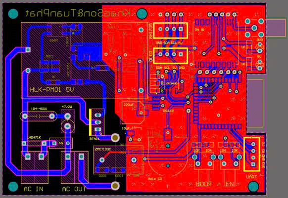
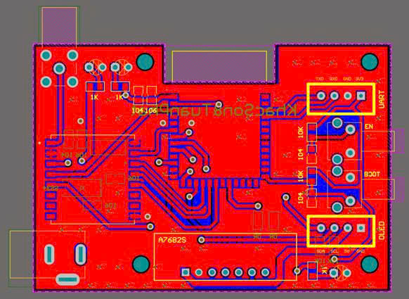
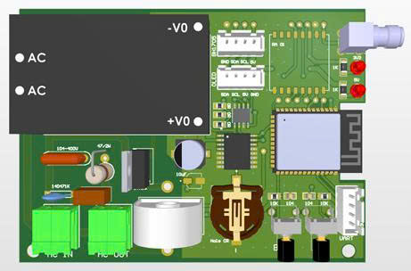
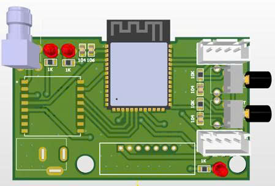
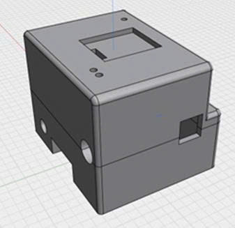
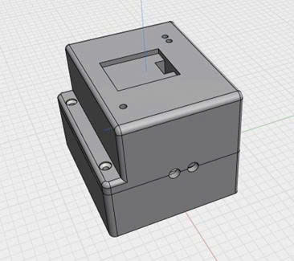
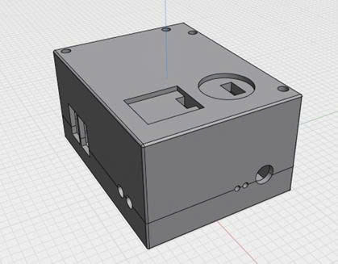
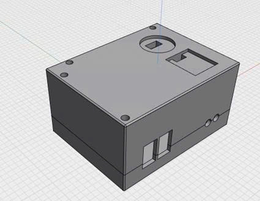
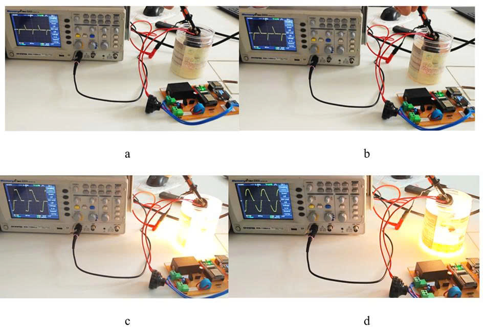
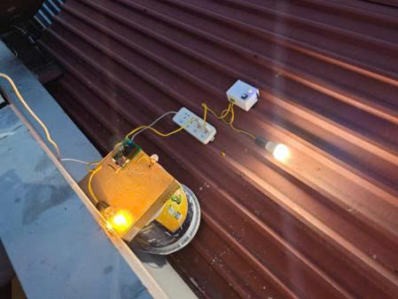

<h1 align="center">Hi 👋, I'm Phat</h1>

  
  
  
  
  

<h3 align="center">🔧 Hardware Engineer | Schematic Review | PCB Debugging & Testing</h3>

  

- 👯 I’m looking to collaborate on **Real-world AI applications, AIoT & Robotics projects**
- 🤝 I’m looking for help with **Optimizing AI on embedded devices, high-performance IoT communication**
- 💬 Ask me about ** Altium, Machine Learning, IoT, AIoT hardware, ESP32 programming, Android, MATLAB, Robotics**
- 📫 How to reach me: **tuanphat27042003@gmail.com**

<h3 align="left">Project:</h3>

<table align="center" cellspacing="15">
  <tr>
    <td colspan="2" align="center">
      <h3> DESIGN BOARD </h3>
      
ALITUM + SHARP3D

    </td>
  </tr>
  <tr>
    <td align="center">
      
    </td>
    <td align="center">
      
    </td>
  </tr>
  <tr>
    <td align="center">
      
    </td>
    <td align="center">
      
    </td>
  </tr>
  <tr>
    <td colspan="2" align="center">
      <h3>  </h3>
      
BOX

    </td>
  </tr>
  <tr>
    <td align="center">
      
    </td>
    <td align="center">
      
    </td>
  </tr>
  <tr>
    <td align="center">
      
    </td>
    <td align="center">
      
    </td>
  </tr>
  <tr>
    <td colspan="2" align="center">
      <h3> SMART LIGHT</h3>
  </tr>
  <tr>
    <td align="center">
      
    </td>
    <td align="center">
      
    </td>
  </tr>
  <tr
